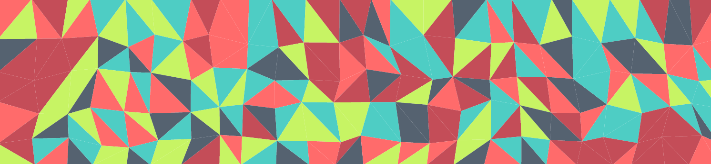

# △ React.js Triangulation SVG (`react-triangulation-svg`)
A component for rendering randomly colored SVG triangle polygons with optional
wave animation support via the SVG [`<animate>`](svg.animate) tag.

[svg.animate]: https://developer.mozilla.org/en-US/docs/Web/SVG/Element/animate

## Getting Started
### With storybook
React.js Triangulation SVG uses [React Storybook](tool.storybook) for prototyping
and displaying a preview of the component. Stories are contained within the
[stories/](stories/) directory.

Run `npm run storybook` to start storybook.

[tool.storybook]: https://getstorybook.io/
