# △ React.js Triangulation SVG
A component for rendering randomly colored SVG triangle polygons with optional
wave animation support via the
SVG [`<animate>`](https://developer.mozilla.org/en-US/docs/Web/SVG/Element/animate)
tag.
